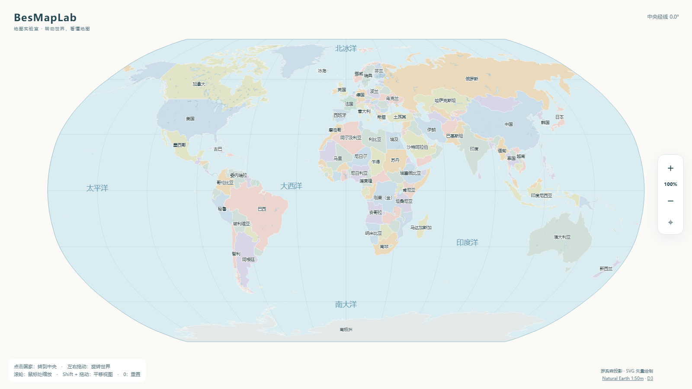

# BesMapLab · 地图实验室

**通过交互了解世界地图。转动世界，看懂地图。**

BesMapLab 是一个开源的世界地图探索项目。我们希望通过旋转、投影比较和多语言内容，帮助对地理好奇的人理解地图如何描绘世界，以及不同画法如何影响我们的认识。

当前是可离线运行的首个原型：使用 Robinson（罗宾逊）投影，将真实经纬度轮廓动态绘制为 SVG。



## 立即体验

[在线体验 BesMapLab](https://bensonlaur.github.io/BesMapLab/)。

下载或克隆仓库后，用现代浏览器直接打开根目录的 **`index.html`**。

无需安装依赖、启动服务或联网。页面已内嵌地图数据、脚本和样式；源码中的外部链接仅用于注明来源。

| 操作 | 效果 |
| --- | --- |
| 点击国家或名称 | 将该地区的参考经度平滑转到地图水平中央，纬度保持不变 |
| 左右拖动 | 外圈轮廓固定，内部地理内容旋转，跨边缘部分从另一侧出现 |
| 鼠标滚轮 | 以鼠标位置为锚点缩放 |
| 双击 / Shift + 双击 | 放大 / 缩小 |
| Shift + 拖动 | 平移当前视图 |
| `+` / `-` / `0` | 放大 / 缩小 / 恢复全图 |

地图轮廓与文字均为 SVG。地图缩放时，地区和海洋标签保持固定的屏幕字号。轮廓放大后保持清晰，但数据的地理细节取决于原始比例尺，放大不会增加新的海岸线细节。

## 已有能力与后续方向

目前已实现 Robinson 动态投影、中文标注、点选水平居中、矢量缩放、拖动旋转和单文件离线使用。

地图还包含 Natural Earth 海上界线指示及中国补充线。这些是地图表达用的线条，不是一套完整的领海或专属经济区范围数据。

以下属于后续计划，尚未实现：

- Equal Earth、Mercator 等投影切换与比较。
- 面积比较、变形解释和地图知识内容。
- 多语言界面及地图标签。
- 保存与分享当前投影、视角和选中地区。
- 平面地图与地球仪同步对照。

详见 [产品定位与路线](docs/PRODUCT.md)。

## 开发

需要 **Node.js 22 或更高版本**。构建使用已随仓库保存的工具，不需要 `npm install`。

```sh
npm run build
npm run check
npm test
```

- `build`：从源数据生成共享边界 TopoJSON，再打包成可直接打开的 `index.html`。
- `check`：检查脚本语法、数据与第三方文件校验值、文本换行，以及已提交页面是否与源码一致。
- `test`：在独立的无头 Chromium 浏览器中验证点选居中、轮廓固定、左右衔接、鼠标锚点缩放与重置。支持自动寻找 Windows Edge；其他环境设置 `BROWSER_PATH` 指向 Chrome、Edge 或 Chromium。

自动化截图和检查报告写入忽略版本控制的 `build/` 目录。

## 目录

```text
index.html           可直接打开的离线页面（构建产物，随仓库提交）
src/                 页面模板、样式和交互源码
data/                Natural Earth 源数据、标签位置、来源与校验值
vendor/              固定版本的第三方库
scripts/             无 npm 依赖的构建与检查工具
tests/               浏览器交互回归检查
docs/                产品定位与实现说明
LICENSES/            第三方许可原文
```

实现说明见 [ARCHITECTURE.md](docs/ARCHITECTURE.md)，参与方式见 [CONTRIBUTING.md](CONTRIBUTING.md)。

## 数据与许可

- 原创代码和文档采用 [MIT](LICENSE)，允许商业使用、修改和再分发，并要求保留许可声明。
- 地理数据来自 [Natural Earth](https://www.naturalearthdata.com/) 1:50m 国家/地区、湖泊、海上界线指示及中国补充数据，属于公有领域。边界与分类沿用该数据集，条目不等同于主权国家数量；项目中文显示名称单独维护。
- 第三方库遵循各自许可，见 [THIRD_PARTY_NOTICES.md](THIRD_PARTY_NOTICES.md)。

自愿打赏可作为未来支持项目的方式；当前版本尚未设置收款入口。
